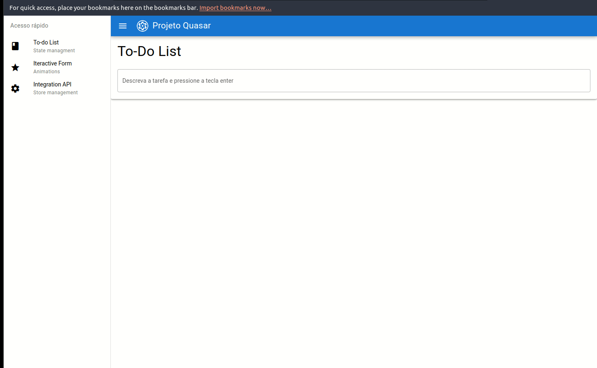
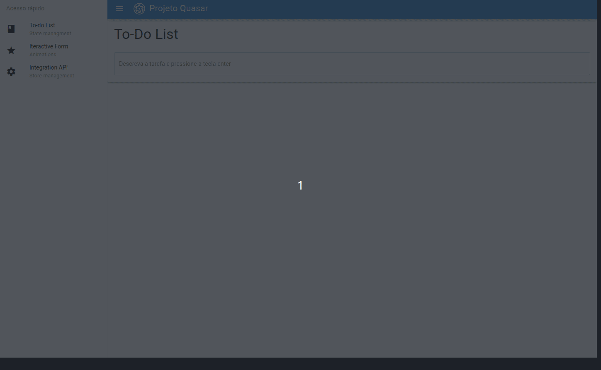
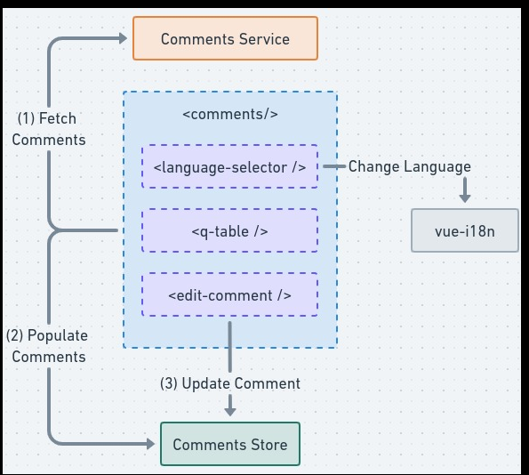
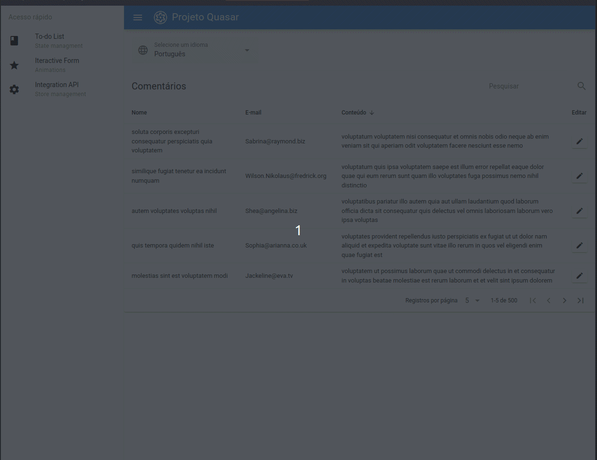

# projeto quasar - to-do list, formulário interativo, store com pinia

Este repositório é sobre um projeto dividido em três partes.

- Uma lista de tarefas (todo-list) onde o usuário pode cadastrar suas tarefas e marcá-las como concluídas.
- Um formulário interativo de cadastro de planos dividido em três partes.
- Uma tabela preenchida com informações provenientes de uma requisição com dados fictícios do jsonplaceholder. A tabela oferece opções de busca por campos de texto, filtros, ordenação, paginação, e também a opção de tradução para os idiomas português e inglês.
- Na tabela, é possível editar informações. Ao realizar essas edições, os dados são atualizados e salvos na store do Vue, utilizando o Pinia.

# Pré-requisitos

- [NodeJS (versão 16 até a 18)](https://nodejs.org/en/)
- [Yarn (versão 1.22 ou superior)](https://yarnpkg.com/)

# Tecnologias

- [Vue](https://vuejs.org/) - Composition API
- [typescript](https://www.typescriptlang.org/)
- [Pinia](https://pinia.vuejs.org/)
- [Quasar](https://quasar.dev/)
- [Zod](https://zod.dev/)

## Instal Yarn

```bash
npm install -g yarn
```

**Clonar projeto**

```bash
git clone https://github.com/marlenesedano/todolist-quasar.git
```

**Acessar diretório**

```bash
cd todolist
```

**Instalar dependências**

```bash
yarn
# or
npm install
```

**Executar aplicação**

```bash
yarn quasar dev
```

**To-do List**

- Uma lista de tarefas to-do list onde o usuário pode cadastrar suas tarefas e marcá-las como concluídas, com notificação de itens cadastrados, e também com uma tratativa para não permitir que o usuário cadastre duas vezes a mesma tarefa.



**Formulário interativo**

- Um formulário temático dedicado ao cadastro de planos de streaming, está dividido em três etapas, onde é necessário preencher informações em cada uma delas, possuindo validação com a lib Zod nos campos de e-mail e telefone. A última etapa oferece um resumo com os dados preenchidos nas etapas anteriores. Devido ao fato de todos os estados serem definidos previamente e utilizados como referências, a inclusão do TypeScript não foi necessária.



**Integração com a API**

- Nesta tarefa, foi efetuada uma requisição na API do jsonplaceholder para obter comentários e salvá-los em uma store do Pinia. Em seguida, esses comentários foram exibidos em uma tabela que oferece funcionalidades como filtro, ordenação, paginação, loading, edição e tradução para os idiomas Português e Inglês. Durante o processo de edição, as alterações realizadas são automaticamente atualizadas na store.




